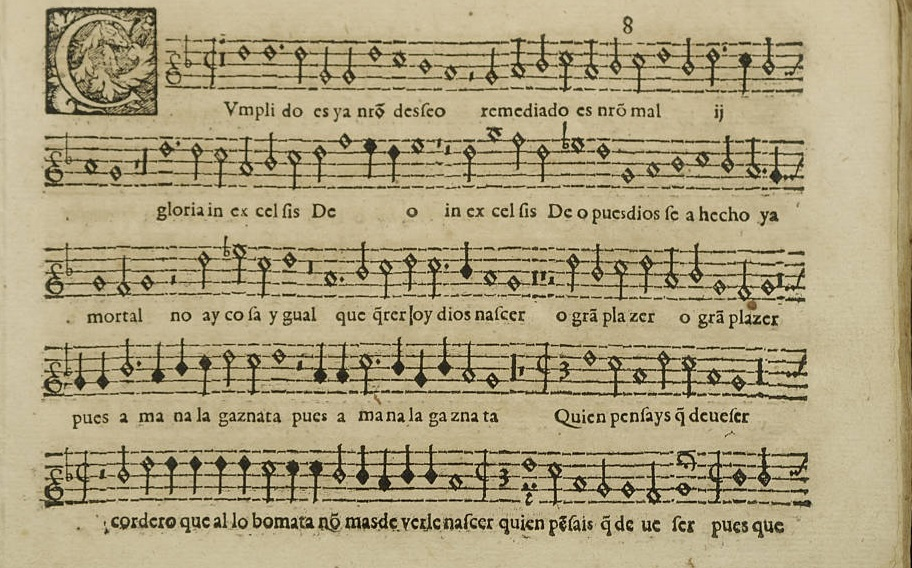

# ÍNDICE

## Índice I

- Presentación: *pandoc/reveal.js*
	- presen.md
- Introducción renacimiento: *beamer*
	- renace.md renace.pdf
- Mateo Flecha: *beamer*
	- FLECHA.md FLECHA.pdf

## Índice II

- Ensaladas: *html5/reveal.js*
	- ENSALADA.html
- Tomás Luis de Victoria: *epub*
	- VICTORIA.epub
- Guion de prácticas: *html y pdf*
	- guion.html guion.pdf

# Renacimiento

## Música renacentista

 **Presentación**

- siglos **XV** y **XVI**. 
- Música polifónica.

## Características

- Música polifónica
- Mezcla sacro y profano
- Mezcla de ritmos y letras

## Partituras supervivientes

{width=60%}\

## DÓNDE

- Lo encuentras en : 
	- **Presentación Beamer renace.pdf o renace.md**
	- [Github renace](https://noimila.github.io/INTRODUCTION/renace.pdf "enlace beamer intro renacimiento")

# Mateo Flecha

## Quién fue Mateo Flecha

- Compositor llamado Mateu Fletxa El Vell.

[Más sobre Mateo Flecha](http://www.musicaantigua.com/las-ensaladas-del-chef-mateo-flecha-el-viejo/ "blog música antigua")

{width=20%}\

## Vida y obras

>1481-1553

>- Sus obras más conocidas **las Ensaladas** 

## DÓNDE

- Lo encuentras en: **Presentación Beamer FLECHA.pdf o FLECHA.md**

- [Github Flecha Beamer](https://noimila.github.io/FLECHA/FLECHA.pdf "enlace beamer Flecha")

# Las Ensaladas

## Características

- Música polifónica
- Mezcla sacro y profano
- Mezcla de ritmos y letras

## Compositores

- Bartolomé Cárceres

[La Trulla de Bartomeu Cárceres ](https://www.youtube.com/watch?v=IQuHC85oKLg "La Trulla de Bartomeu Cárceres")

## Ensaladas Mateo Flecha
- Cancionero recogido por Mateo Flecha el Joven (sobrino)
	- La Bomba
	- La negrina
	- El Fuego

## Dónde
- Lo encuentras en: **Presentación ENSALADAS.html**

- [Github Ensaladas](https://noimila.github.io/ensaladas/ENSALADA.html "enlace presentación Ensaladas")

# Tomás Luis de Victoria

## Vida
- Fechas (1548-1611)
- Estancia en Roma

## Obras
- Solo música vocal y sacra
["O magnum mysterium"](https://www.youtube.com/watch?v=9xPh-fXYAc4 "o_magnum_mysterium")

## Dónde 
- Lo encuentras en: **Ebook VICTORIA.epub**

- [Github Ebook Victoria](https://github.com/noimila/ebook/blob/main/VICTORIAEBOOK.zip "enlace Ebook Victoria")

# GUION DE PRÁCTICAS

## Dónde
- Lo encuentras en: **guion.pdf o guion.html**

- [Github Guion pdf](https://noimila.github.io/guionpdf/guion.pdf "enlace guion prácticas pdf")

- [Github Guion HTML](https://noimila.github.io/guionhtml/guion.html "enlace guion prácticas html")

## FIN
¡¡¡Pasamos al contenido!!!